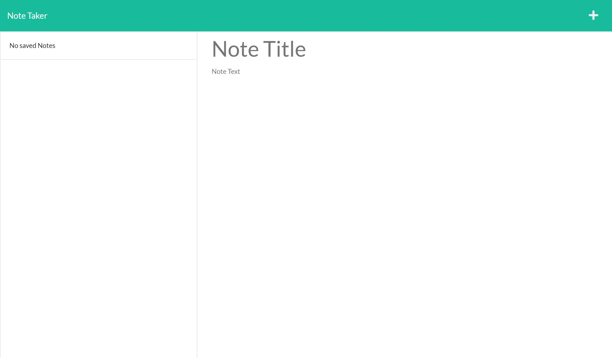

# POSTit_Notes

## Description
This webpage is used add store and remove notes. USers can add a title and note have ot saved till the user chooses to delete it from the list.

## Table of Contents
- [Installation](#installation)
- [Usage](#usage)
- [Credits](#credits)
- [License](#license)
  
## Installation
N/A

## Usage
The user will be presented with the starting page. Users will press "Get Started". That will direct them to the next page. That page will allow users to type in a title and note. When the user is done with there input, there will be a save button on the top right corner. The user will click on the Floppy disk icon to save the note to the left hand side of the screen. This note will be saved until the the user presses the trash can icon that deletes the note from the list.

## Credits
N/A

## Deployment Link
https://warm-reaches-73613.herokuapp.com/

## License
N/A

## Questions
https://github.com/YacovKopel
